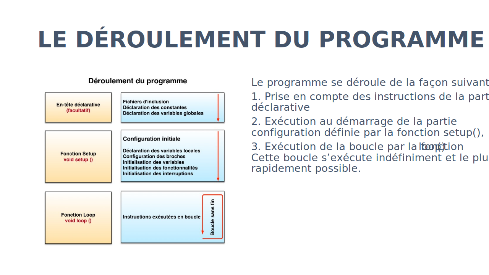

# Le code Arduino

## Référence Arduino

* [Référence Arduino](https://www.arduino.cc/reference/en/)


## Code minimal

```cpp

// VARIABLE GLOBALES

void setup() {
  // CODE À ROULER AU DÉMARRAGE

}

void loop() {
  // CODE À RÉPÉTER (LE PLUS RAPIDEMENT POSSIBLE)

}
```
Nous retrouvons deux fonctions dans le code minimal :
* setup()
* loop()

### setup()

La fonction setup() est appelée une seule fois lorsque le programme commence. C'est pourquoi c'est dans cette fonction que l'on va écrire le code qui n'a besoin d'être exécuté qu’une seule fois. C'est une  fonction d'initialisation. On y retrouvera la mise en place des différentes sorties et quelques autres réglages.

### loop()

Une fois que l'on a initialisé le programme, il faut ensuite créer le «cœur» du programme, autrement dit le programme en lui même. C'est dans la fonction loop() que l’on va écrire le contenu du programme. Il faut savoir que cettefonction est appelée en permanence, c'est-à-dire qu'elle est exécutée une fois, puis lorsque son exécution est terminée, on la réexécute, encore et encore. On parle de boucle infinie!

## Déroulement du programme



## Les instructions 


## Variables de base


## Analyse du code «Blink»


## Ressources

* [FLOSS Manuals: Programmer-Arduino / Arduino](https://fr.flossmanuals.net/arduino/programmer-arduino/)

## Bien coder

[FLOSS Manuals: Comment-Bien-Structurer-Son-Code / Arduino](https://fr.flossmanuals.net/arduino/comment-bien-structurer-son-code/)