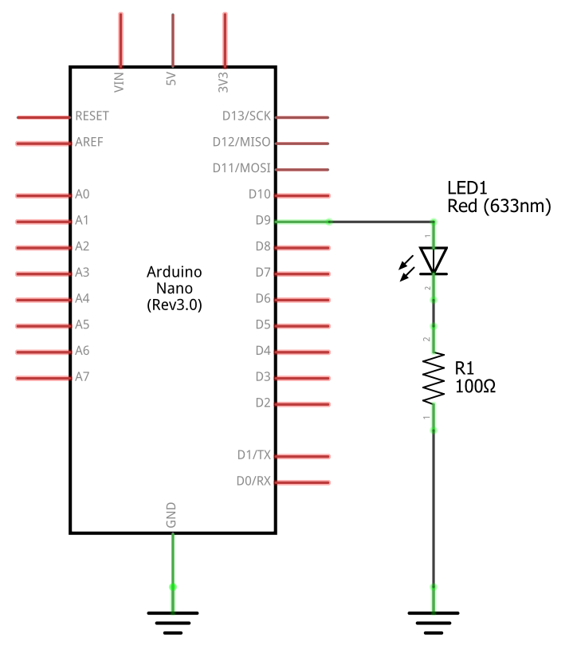

# Chandelle

Dans cet exemple, nous simulons une chandelle en faisant varier aléatoirement l'intensité d'une DEL. 

## Aléatoire

La fonction `random()` permet de générer un entier `int` entre un minimum et un maximum. Il est très important de remarquer que  que la valeur maximale est exclue des valeurs possibles; si le miminum est 0 et le maximum est 5, les valeurs possibles sont 0,1,2,3,4 (sans le 5).


Exemple d'utilisation de `random()`:
```arduino
int monMin = 0;
int monMax = 255;
int maValeurAleatoire = random( monMix , monMax );
```


## Circuit

### Composants
* Un Arduino avec une sortie analogique
* Une DEL
* Une résistance pour limiter l'intensité du courant qui traverse la DEL

### Notes
* La DEL doit être connectée à une sortie analogique de l'Arduino

### Schéma


## Code
```arduino

```