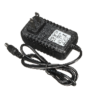

# Le courant électrique

Le courant électrique est un déplacement d’électrons dans un milieu conducteur.

Pour que ces électrons se déplacent il faut créer **une différence du nombre d'électrons entre les deux extrémités du circuit électrique**. C'est ce qu'on appelle une **différence de potentiel**.

# Alimentation

Pour créer cette différence de potentiel, on utilise une **alimentation électrique** qui peut prendre la forme d'une batterie, alimentation USB, panneau solaire, prise électrique , etc.

  

Une alimentation possède deux pôles. L'un **positif** (avec un potentiel *haut*) et l'autre **négatif** (avec un potentiel *bas*). 

  

# Boucle électrique

Pour circuler, le courant doit suivre une boucle entre les deux pôles de l'alimentation.

  
