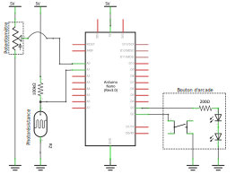
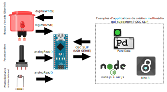
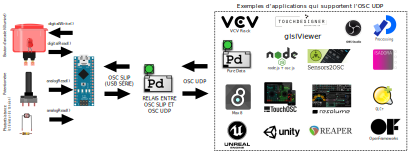
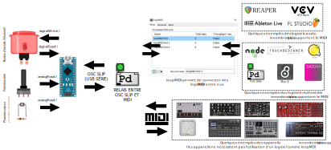

# OSC SLIP

## Prenons comme exemple le circuit suivant



## Voici le code OSC SLIP pour Arduino

```Arduino
// HARDWARE REQUIREMENTS
// ==================
// Potentiometer connected to analog pin A0
// Photocell connected to analog pin A1
// Switch connected to pin 2
// LED connected to pin 3

// REQUIRED LIBRARIES
// ==================
// MicroOsc

// REQUIRED CONFIGURATION
// ======================
// Set Serial baud to 115200


#include <MicroOscSlip.h>
// The number 64 between the < > below  is the maximum number of bytes reserved for incomming messages.
// Outgoing messages are written directly to the output and do not need more reserved bytes.
MicroOscSlip<64> myMicroOsc(&Serial);

unsigned long myChronoStart = 0;

const int myPotPin = A0;
int myPotPreviousValue;

const int myPhotoPin = A1;
int myPhotoPreviousValue;

const int myButtonPin = 2;
int myButtonPreviousValue;

const int myLedPin = 3;

void setup() {
  // INITIATE SERIAL COMMUNICATION
  Serial.begin(115200);
  pinMode( myPotPin , INPUT);  // ANALOG INPUT
  pinMode( myPhotoPin , INPUT);  // ANALOG INPUT
  pinMode( myButtonPin , INPUT_PULLUP);  // DIGITAL INPUT
  pinMode( myLedPin , OUTPUT); // DIGITAL OUTPUT
}

// FUNCTION THAT IS CALLED FOR EVERY RECEIVED MESSAGE
void myReceiveOscMessage( MicroOscMessage & myOscMessage ) {
  if ( myOscMessage.fullMatch("/led") ) { // IF THE ADDRESS IS /led
    int myLedValue = myOscMessage.nextAsInt(); // GET VALUE AS INT
    digitalWrite( myLedPin , myLedValue); // SET LED VALUE TO LED
  }
}

void loop() {
  myMicroOsc.receiveMessages( myReceiveOscMessage );

  unsigned long myChronoElapsed = millis() - myChronoStart;
  unsigned long myChronoInterval = 50;
  if ( myChronoElapsed >= myChronoInterval) {
    myChronoStart = millis(); // RESTART CHRONO

    // POTENTIOMETER
    int myPotValue = analogRead(myPotPin); // READ CURRENT VALUE
    if ( myPotValue != myPotPreviousValue ) myMicroOsc.sendInt( "/pot" , myPotValue  );
    myPotPreviousValue = myPotValue; // STORE CURRENT VALUE
    
    // PHOTOCELL
    int myPhotoValue = analogRead(myPhotoPin); // READ CURRENT VALUE
    if ( myPhotoValue != myPhotoPreviousValue ) myMicroOsc.sendInt( "/photo"  , myPhotoValue  );
    myPhotoPreviousValue = myPhotoValue; // STORE CURRENT VALUE

    // BUTTON
    int myButtonValue = digitalRead(myButtonPin); // READ CURRENT VALUE
    if ( myButtonValue != myButtonPreviousValue ) myMicroOsc.sendInt( "/button"  ,myButtonValue  );
    myButtonPreviousValue = myButtonValue; // STORE CURRENT VALUE

  }
  
}
```


## Scénarios de connectique

Il existe plusieurs scénarios de connectique possible. Les trois scénarios suivants sont détaillés dans les prochaines pages.

### Avec une application qui supporte directement l'OSC SLIP



### Avec une application qui supporte l'OSC UPD à l'aide d'un relais OSC SLIP ⇄ OSC UDP



### Avec une application qui supporte le MIDI à l'aide d'un relais OSC SLIP ⇄ MIDI




