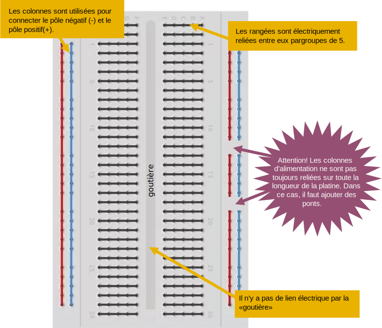

# Platine d'expérimentation (*breadboard*)

Une platine d’expérimentation (*breadboard* en anglais) permet de réaliser des prototypes de circuits électroniques sans soudure et donc de pouvoir réutiliser les composants. 

Certains des trous de la platine d'expérimentation sont connectés entre eux. Ces connexions sont indiquées par des lignes dans l'illustration suivante.

* Tous les trous dans une rangée intérieure de 5 sont reliés entre eux. 
* Les trous des colonnes extérieures sont reliés entre eux. Ils sont réservés à l'alimentation :
	* Colonne rouge pour le pôle positif (+).
	* Colonne bleue pour le pôle négatif (-).

# Bien placer les composants sur la platine d'expérimentation

Les broches (pattes) des composants doivent être insérés dans des trous qui sont **non reliés électriquement**, c'est à dire **isolée** électriquement. 

Dans la figure suivante :
* Le **X** indique une erreur où un composant dont les broches sont insérées dans des trous reliés électriquement.
* Les **✓** indiquent des bonnes connexions où chaque broche du composant est isolé électriquement. 

Dans la figure suivante :
* Le **X** indique une erreur où un composant dont les broches sont insérées dans des trous reliés électriquement.
* Les **✓** indiquent des bonnes connexions où chaque broche du composant est isolé électriquement. 

