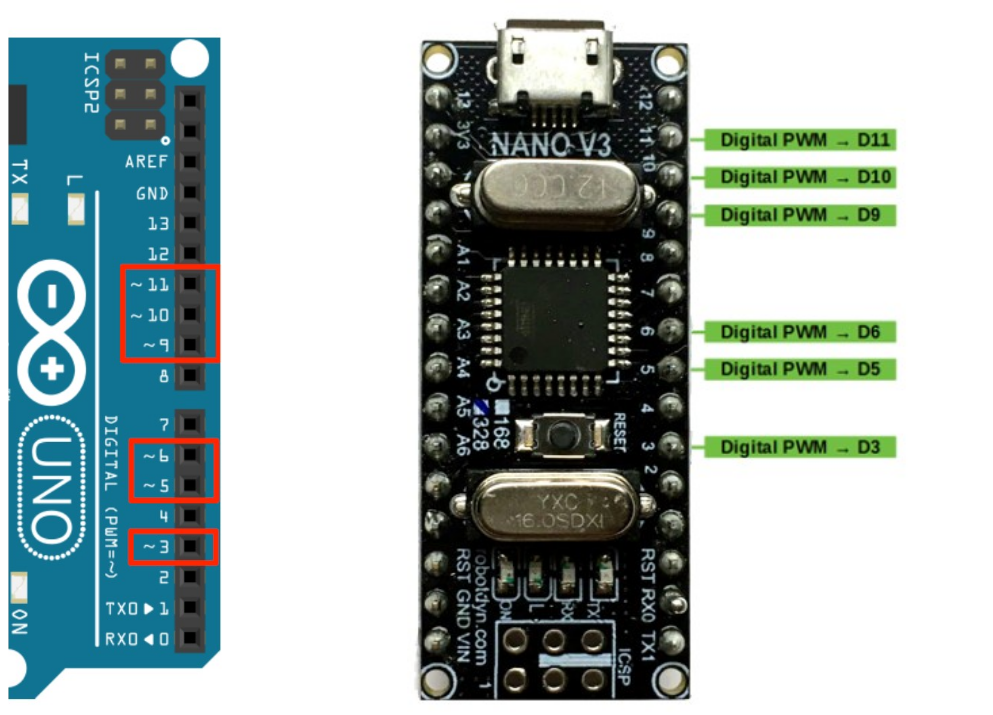

# Sortie analogique (PWM: modulation de largeur d'impulsion)


Un sortie analogique permet de **simuler** une variation de tension électrique. Par exemple, un sortie analogique peut être utilisée pour faire varier la luminosité d'une DEL et effectuer des effets de fondu.

Pour **simuler** cette variation de tension, nous utilisons la modulation de largeur d'impulsion, *Pulse Width Modulation (PWM)* en anglais. Il s'agit de faire alterner à grande fréquence les périodes hautes (allumée) et basses (éteinte) de la broche.  En d'autre termes, cela signifie que la DEL clignote très très vite. Tellement vite que l'oeil ne percevra qu'une lumière continue qui varie d'intensité. 


Pour effectuer une sortie analogique, nous utilisons la paire de fonctions suivantes :
1) Configurer la broche `maBroche` en mode sortie avec `OUTPUT` :
```arduino
pinMode( maBroche , OUTPUT );
```
2) Contrôler la modulation de largeur d'impulsion, qui est entre 0 et 255, de la broche `maBroche` avec `analogWrite()` :
```arduino
int maValeurPWM = 255; // VALEUR ENTRE 0 et 255
analogWrite( maBroche, maValeurPWM );
```


## Broches
Les broches capables de supporter modulation de largeur d'impulsions sont identifiées par un «~» ou le mot «PWM». Il s'agit des broches 3, 5, 6, 9, 10 et 11 pour l'Arduino Nano.

## Debogage d'une sortie analogique


Le code suivant permet de déboguer la sortie nummérique à l'aide d'une DEL branchée à la broche 9. À chaque 30 millisecondes, la largeur d'impulsion est augmentée de 5. Lorsque la valeur dépasse 255, elle retombe à 0.

```arduino
int maDelBroche = 9;
int maDelPWM = 0;

unsigned long monChrono;

void setup() {
  Serial.begin(115200);
  
  pinMode( maDelBroche , OUTPUT);
}

void loop() {
  if ( millis() - monChrono >= 30 ) {
    monChrono = millis();
    
    maDelPWM = maDelPWM + 5;
    if ( maDelPWM > 255 ) maDelPWM = 0;

    analogWrite( maDelBroche , maDelPWM );

    Serial.print("analogWrite(");
    Serial.print(maDelBroche);
    Serial.print(",");
    Serial.print(maDelPWM);
    Serial.print(")");
    Serial.println();
  }
}
```